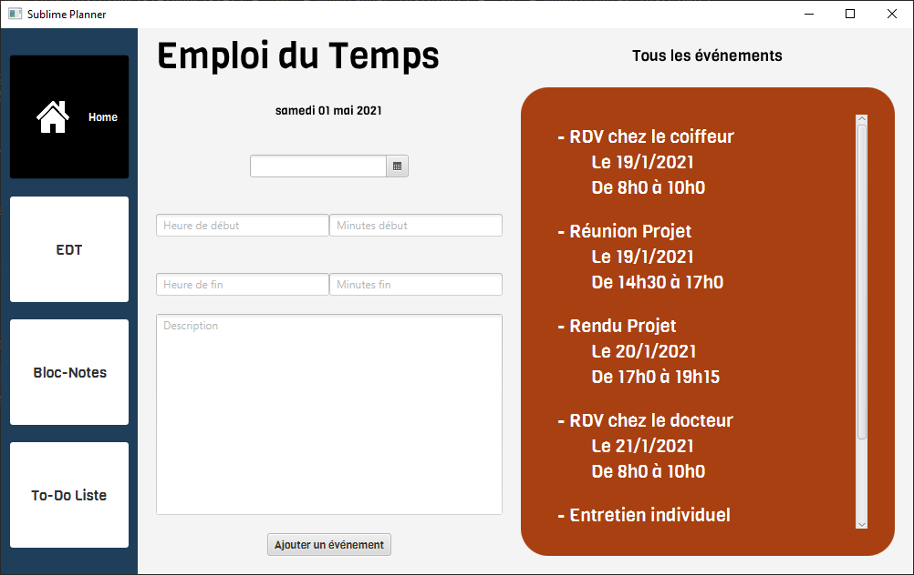

# SublimePlanner
SublimePlanner is a powerfull app that allows you to plan your days, with timetable, todo lists and notes. 

### Description (French)

Organiser ses journées et surtout son travail est d'une importance capitale pour réussir et pour avoir une vie privée à côté !:joy: 
C'est pour cela que nous avons décidé de créer Sublime Planner, application de type "Planner" qui regroupe toutes les fonctionnalités indispensables de gestion 
de temps et des rappels, que l'on retrouve généralement dans des applications disjointes, dans une seule et même solution ! 
On a pensé à vous avant même que vous nous le demandiez ! Point faible : TROP FORT ! :muscle: :sunglasses:

Cette application vous permettra de commencer votre journée dans les meilleures conditions grâce à sa page d'accueil sobre 
et mettant en avant les informations les plus importantes pour cette journée comme les évènements et les taches a effectuer.

Elle vous permettra également de gérer votre emploi du temps en créant des évènements associés à des créneaux horaires et des jours, mais aussi de
créer des notes textuelles regroupées par catégories personnalisées et enfin de gérer votre liste de tâches en créant des tâches personnalisées regroupées 
dans des catégories personnalisées.

### Description (English)

Organizing your days and especially your work is of capital importance to succeed and to have a private life on the side!:joy: 
This is why we decided to create Sublime Planner, a "Planner" type application that brings together all the essential time management 
and reminders functionalities, which are generally found in separate applications, in one and the same solution!
We thought of you before you even asked us! Weak point: TOO STRONG! :muscle: :sunglasses:

This application will allow you to start your day in the best conditions thanks to its sober home page and highlighting the most important information 
for this day such as events and tasks to be carried out.

It will also allow you to manage your schedule by creating events associated with time slots and days, but also to create textual notes 
grouped by personalized categories and finally to manage your to-do list by creating personalized tasks grouped in specific categories.

### Doc

You will find all the documentation of this project in the **trunk/doc** folder.

### Visuals

